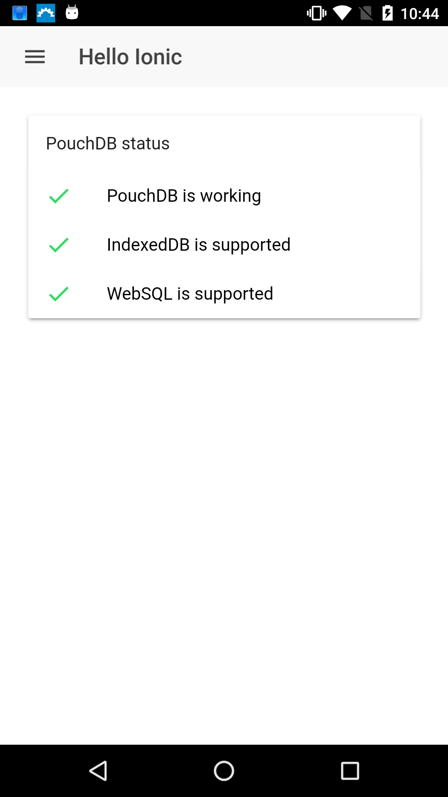

PouchDB Ionic 2 "hello world" app
======

*This project is the copy the https://github.com/nolanlawson/pouchdb-ionic-hello-world create in ionic 1*

This is a basic Ionic 2 app. It was created using the `ionic` CLI, but for running this project use:

	git clone https://github.com/djuniorscjr/pouch-ionic2-hello-world.git && cd pouch-ionic2-hello-word

Then to install PouchDB and other plugins basic the Ionic 2, I ran:

    npm install
    

To run the app yourself on a variety of platforms, just check out the code and follow the instructions below.    
#### Android

    ionic platform add android
    ionic run android
    
What you'll see:

#### Other platforms

Feel free to try it out and take screenshots. :)
